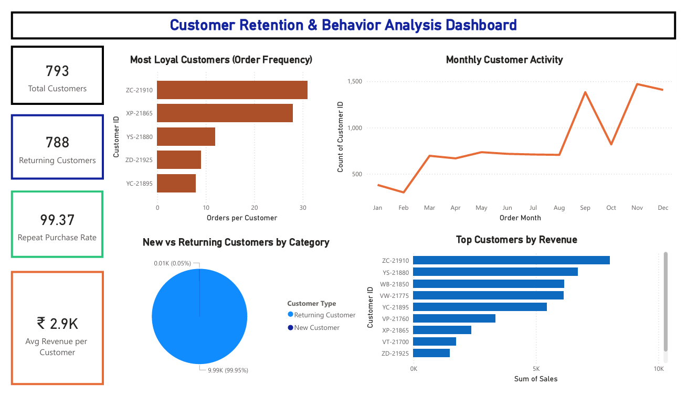

# 📊 Customer Retention & Behavior Analysis Dashboard (Power BI)

## 📌 Project Overview

This project analyzes customer purchasing behavior using a retail sales dataset.
The objective is to understand **customer retention, repeat purchase behavior, and revenue contribution** using an interactive Power BI dashboard.

---

## 🧩 Business Problem

Businesses often focus more on acquiring new customers rather than retaining existing ones. However, returning customers usually generate more revenue and are more likely to make repeat purchases.

This project analyzes customer transaction data to understand **customer behavior and retention patterns**.

---

## 🛠 Tools Used

* 📊 Power BI Desktop
* 📐 DAX (Data Analysis Expressions)
* 📁 Excel Dataset
* 🗂 GitHub

---

## 📂 Dataset Information

The dataset contains retail transaction data with fields such as:

* Order ID
* Order Date
* Customer ID
* Category
* Sales
* Profit

Each row represents a **single customer purchase transaction**.

---

## 📈 Key Metrics

The dashboard tracks important business metrics including:

* 👥 Total Customers
* 🔁 Returning Customers
* 📊 Repeat Purchase Rate
* 💰 Average Revenue per Customer
* 🧾 Orders per Customer
* 💵 Sales by Customer

---

## 📊 Dashboard Visualizations

### 👥 Customer Distribution by Category

Shows how customers interact with different product categories.

### 📅 Monthly Customer Activity

Displays how customer activity changes over time.

### 🏆 Top Customers by Revenue

Identifies customers who generate the highest sales.

### ⭐ Orders per Customer

Shows the most loyal customers based on order frequency.

---

## 🔍 Key Insights

Although insights are not directly displayed on the dashboard, the analysis shows that:

* 📌 A small number of customers contribute a large portion of total revenue.
* 🔁 Returning customers place multiple orders compared to new customers.
* 💰 Some customers generate significantly higher revenue than others.
* 📊 Customer activity varies across months.

---

## 🖼 Dashboard Preview

---

## 👩‍💻 Author

**Deeksha Mohan**
